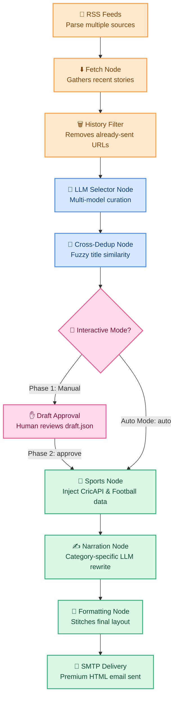

# 🌅 The Morning Drop

> **Elevating daily news from a chore to a conversation.** An AI-driven, agentic newsletter curation engine designed specifically for Gen-Z & young professionals in India who skip traditional news but love social media doomscrolling.

---

## 🎯 The Business Case

| The Problem 😴 | The Vibe-Check Solution ⚡ |
| :--- | :--- |
| **Information Overload**: 100+ RSS feeds, newsletters, and articles are published daily. Nobody has time to read them. | **Curation Layer**: An agentic pipeline automatically parses, filters, and selects only the absolute best stories. |
| **Stiff & Boring Tone**: Traditional news is dry, full of corporate jargon, and distant from youth culture. | **Persona-Driven Writing**: Converts complex topics into conversational, witty, and meme-friendly summaries. |
| **Duplicate Fatigue**: The same story is repeated across multiple domains (e.g. tech/finance crossover). | **Intelligent Cross-Dedup**: An 85%+ semantic comparison filter ensures a clean, repeat-free reading experience. |
| **Static News**: Sports sections are written hours before publication, missing late-night live results. | **Live scoreboard Integrations**: Cricket and football live API data injected dynamically into LLM prompts. |

---

## 🚀 MVP (Minimum Viable Product) Features

```
┌────────────────────────────────────────────────────────────────────────┐
│                              CORE ENGINES                              │
├───────────────────┬───────────────────┬────────────────────────────────┤
│ 📰 Curation Engine│ ⚡ Personality     │ 🛠️ Enterprise Operations        │
│ • RSS Parser      │ • Multi-persona   │ • SQLite memory database       │
│ • LLM selector    │ • Gen-Z Indian    │ • Scheduled runner (7 AM)      │
│ • Fuzzy dedup     │   localization    │ • Automated HTML styling       │
│ • Sports API      │ • Smart analogies │ • Human-In-The-Loop review     │
└───────────────────┴───────────────────┴────────────────────────────────┘
```

---

## 🧠 Agentic Workflow (LangGraph)

Our curation pipeline is powered by a structured state machine graph using **LangGraph**. Below is the diagrammatic representation of the workflow showing how raw data flows to final email delivery:



### 🤖 Supported Curation Models

To ensure high curation quality and robust fallback redundancy, the pipeline queries models via OpenRouter in this preferred order:
1. **DeepSeek-V3** (`deepseek/deepseek-chat`) — Primary high-performance curator
2. **Llama 3.3 70B & Llama 3 8B** (`meta-llama/llama-3.3-70b-instruct:free`, `meta-llama/llama-3-8b-instruct` (paid/free)) — Extremely conversational and robust
3. **GPT-OSS-120B** (`openai/gpt-oss-120b:free` / `openai/gpt-oss-120b`) — OpenAI's high-reasoning open-weights model
4. **Google Gemma 4 31B** (`google/gemma-4-31b-it:free` / `google/gemma-4-31b-it`) — State-of-the-art reasoning model
5. **Fallback Cluster** — `llama-3.1-nemotron-70b-instruct`, `gemini-flash-1.5`, `gemini-pro-1.5`, and `mistral-7b-instruct:free`

---

## 🎭 The Vibe Engine (Category Personas)

The newsletter is split into distinct categories, each styled with unique accent colors and targeted LLM personas:

```
  🇮🇳 India & Tamil Nadu (Terracotta & Jade)
  └─ Conversational, friendly context on domestic events.
  
  🌍 World in 60 Seconds (Dusk Blue)
  └─ Global headlines, boiled down to the absolute essentials.
  
  💸 Money & Jobs (Golden Sand)
  └─ Layman stock & company insights. Translates "SIPs" and "IPOs" into real wallet impacts.
  
  💻 Tech & AI (Lavender)
  └─ Futurist focus. Explains how tech breakthroughs affect the reader's life in 1-3 years.
  
  🏅 Sports (Coral Blush)
  └─ Live Scorecards + "Tournament Radar" (Cricket & Football) tracking key plays & drama.
  
  🍿 Entertainment & WTF (Deep Teal & Aqua)
  └─ Pop-culture catchups and bizarre, internet-breaking events.
```

---

## 📈 Scalability & Monetization Potential

1. **Hyper-Personalized Feeds**: Let users pick their own domain configurations inside `config.yaml`.
2. **Sponsor Slots**: Dynamically inject custom visual sponsor blocks between categories using LangGraph nodes.
3. **Analytics Integration**: Track email open-rates and interaction to feed back into the LLM curator.

---

## 🛠️ Quick Launch Guide

### 1. Register Automation (7:00 AM Daily)
To run the automated script every morning at 7 AM:
Open **PowerShell as Administrator** and execute:
```powershell
Set-ExecutionPolicy Bypass -Scope Process -Force; & ".\setup_scheduler.ps1"
```

### 2. Manual Curation Pipeline (Human-in-the-Loop)
If you prefer to review what gets sent:
```bash
# Phase 1: Fetch and save curated stories to draft.json
python main.py --draft

# [Review and edit draft.json to remove unwanted stories]

# Phase 2: Generate narration and deliver the email
python main.py --approve
```
